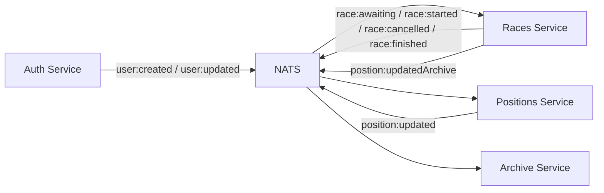
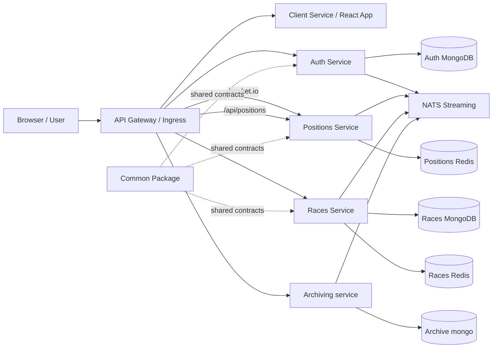
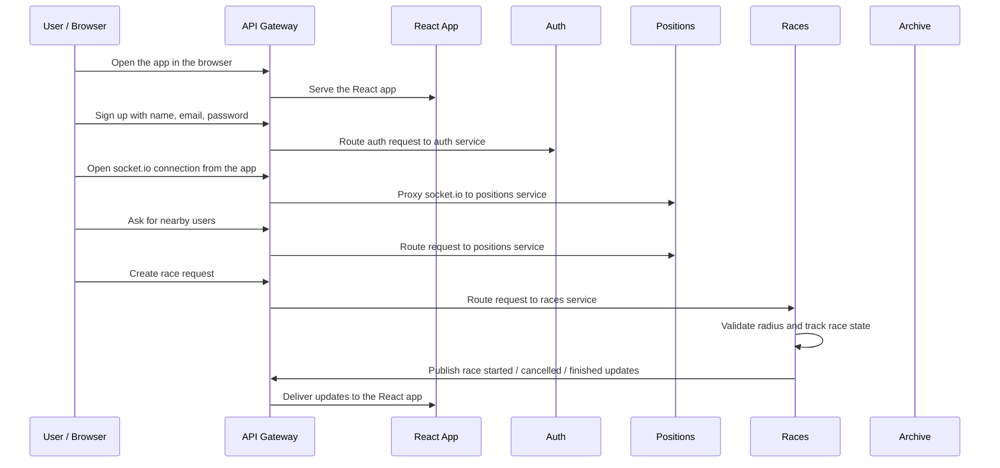
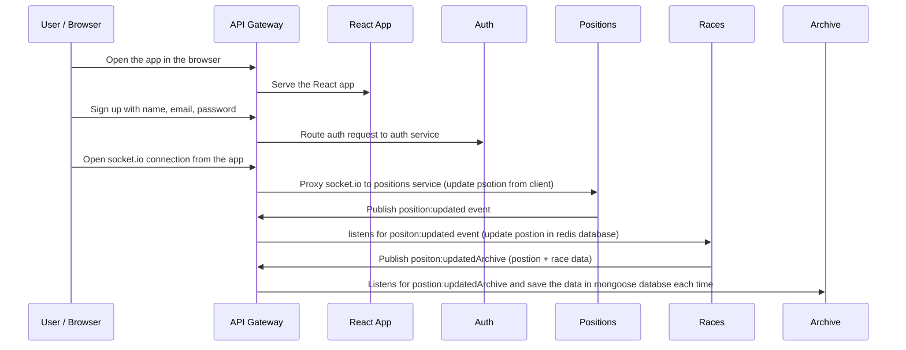

# racer.io

racer.io is a microservices racing app built around an API gateway, live position tracking, and race orchestration. Users reach the gateway first, then the gateway routes them to the React app, the auth service, the positions service, or the races service depending on the request.

## What You Need

To run the app locally you need:

- Docker
- kubectl
- Skaffold
- a local Kubernetes cluster such as Docker Desktop Kubernetes, minikube, or kind
- a `jwt-secret` Kubernetes secret with `JWT_KEY`
- a `ticket-com-tls` TLS secret for the ingress host `ticket.com`

You also need `ticket.com` to resolve to your local ingress IP in your hosts file.

## Run Locally

1. Start your local Kubernetes cluster and make sure `kubectl` is connected to it.
2. Create or confirm the required secrets exist in the cluster.
3. Run `skaffold dev` from the repo root.
4. Add `ticket.com` to your hosts file if it is not already mapped to the ingress controller.
5. Open `https://ticket.com` in your browser.

## API Gateway

The API gateway is the Kubernetes ingress in `infra/k8s/ingress-srv.yaml`. It is the public entry point for the app and the browser connects to it first. It routes traffic to the correct service based on the request path:

- `/api/users` goes to the auth service.
- `/api/positions` and `/socket.io` go to the positions service.
- `/api/races` goes to the races service.
- `/api/archive` goes to the archive service.
- everything else goes to the client service.

This keeps the browser talking to one public host while the backend remains split into isolated services. The browser loads the React app through the gateway, and the socket.io connection from the app is also proxied through the gateway to the positions service.

## Core Idea

The app is built around live location tracking and race orchestration. A user signs up through the client, the positions service keeps track of where users are, and the races service decides whether a race can be created, accepted, started, and finished and aslo works as archive currently (will be seperated to two services in the future).

## Architecture

- `client`: React front end for signup, login, the dashboard, and race history.
- `auth`: user signup, signin, and current-user endpoints.
- `positions`: receives location updates, finds nearby users, and emits position events.
- `archive`: receives user postions and races , doesnt emit any events currently.
- `races`: creates race records, handles acceptance, tracks active races, and marks them finished.
- `common`: shared events, middleware, enums, and error helpers : https://www.npmjs.com/package/@racer-io/common
- `infra`: Kubernetes manifests and ingress configuration for local or cluster deployment.

The services are intentionally split so each one owns its own data and responsibility:

- auth owns user accounts and stores them in its own MongoDB.
- positions owns live location state and stores it in its own Redis instance.
- races owns race records in its own MongoDB and race state in its own Redis instance.
- NATS is the event bus used to move events between services.

## Deployment Layout

The `skaffold.yaml` file builds and syncs the four app containers:

- `racer-auth`
- `racer-positions`
- `racer-races`
- `racer-client`
- `racer-archive`

The `infra/k8s` folder wires the runtime pieces together:

- `ingress-srv.yaml` is the API gateway. It exposes the app on `ticket.com` and routes `/api/users`, `/api/positions`, `/api/races`, `/socket.io`, and the client root path.
- `auth-depl.yaml` runs the auth service with its own MongoDB and NATS.
- `positions-depl.yaml` runs the positions service with its own Redis and NATS.
- `races-depl.yaml` runs the races service with its own MongoDB, its own Redis, and NATS.
- `archive-depl.yaml` runs the archive service with its own MongoDb , and NATS
- `client-depl.yaml` serves the React app.
- `nats-depl.yaml` provides the event bus used for inter-service communication.

Each service owns its own storage. The databases and Redis instances are not shared between services.

## Events

Events are sent through NATS so services can react to state changes without being tightly coupled.

### Shared Subjects

- `user:created`: published by auth after signup, consumed by races to create the local user record.
- `user:updated`: published by auth when a user profile changes, consumed by races to keep the local copy in sync.
- `position:updated`: published by positions when a client sends a new GPS sample, consumed by races to keep live user position state current.
- `race:awaiting`: published by races after a race is created, consumed by positions to notify the invited user over socket.io.
- `race:started`: published by races after a race is accepted, consumed by positions to update socket state and user status.
- `race:cancelled`: published by races when a race is rejected, consumed by positions to notify the waiting user.
- `race:finished`: published by races when a winner is detected, consumed by positions to reset users back to idle.

### Event Flow

1. The client sends a signup request to the auth service.
2. Auth creates the user and publishes `user:created`.
3. Races stores that user locally so race records can be resolved without calling auth.
4. The client sends live GPS updates through the gateway to positions.
5. Positions updates Redis and publishes `position:updated`.
6. Races consumes the position stream to keep race logic aligned with the latest user locations and sent 
a `positon:updatedArchive` event for the archiving service for archiving data
7. When the client creates a race, races publishes `race:awaiting`.
8. Positions receives `race:awaiting` and emits the invitation to the invited user over socket.io.
9. When the race is accepted or rejected, races publishes `race:started` or `race:cancelled`.
10. Positions receives those lifecycle events and pushes the socket updates to the browser.
11. When a winner is detected, races publishes `race:finished` and positions resets both users back to idle.

## How The Flow Works

1. A user signs up in the client with a name, email, and password.
2. The auth service creates the user account and returns the authenticated session.
3. The client streams GPS updates to the positions service.
4. The positions service keeps track of nearby users and broadcasts position updates to Races service.
5. The client creates a race request when two users are close enough (validation and calulations are done to insure that the race could be possible)
6. The races service stores the race, waits for acceptance, and monitors the race until a winner is found.
7. all of this to insure a great race with microservices architactures for more details
it will detailed in the code 

## Service Diagram

## Request Flow

## Position Update flow

