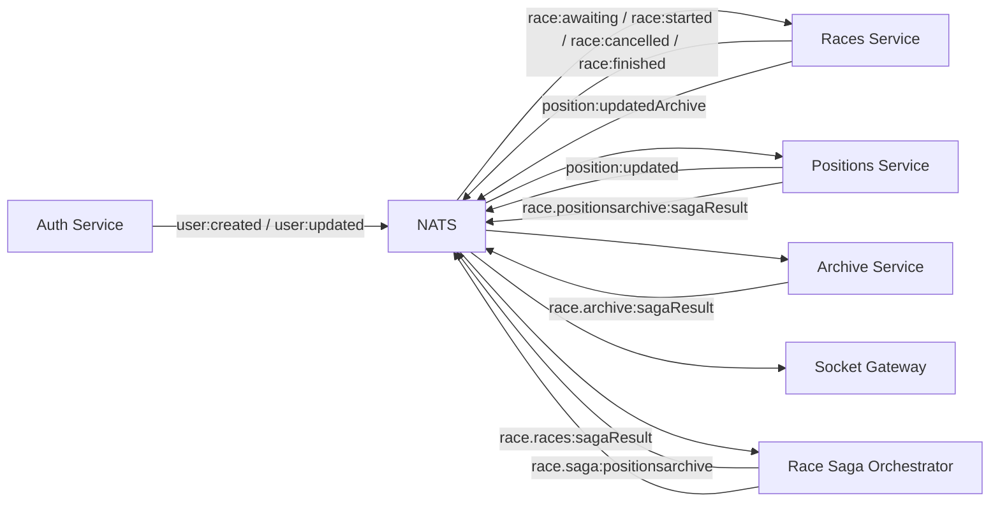
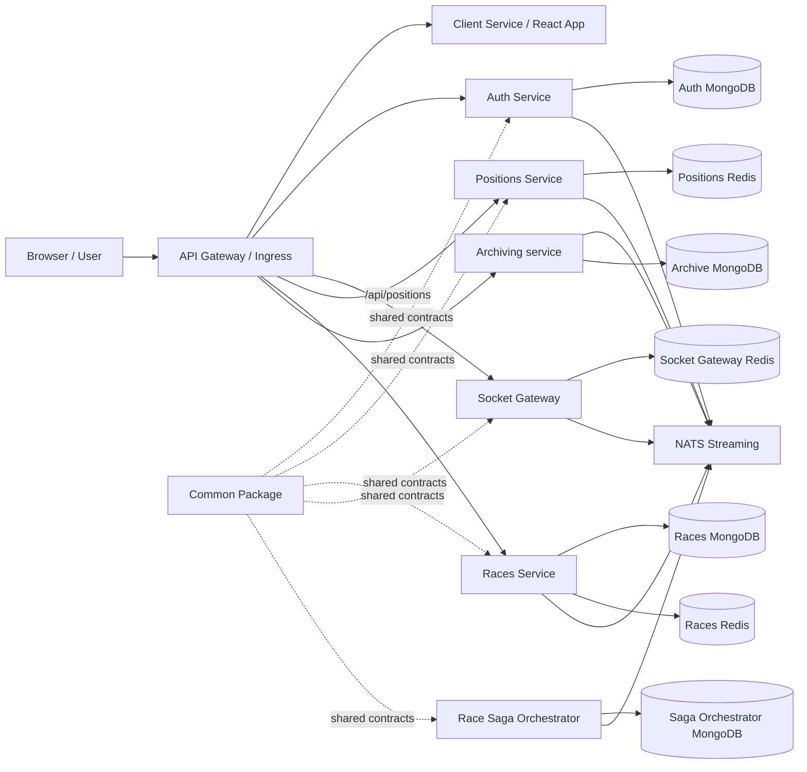
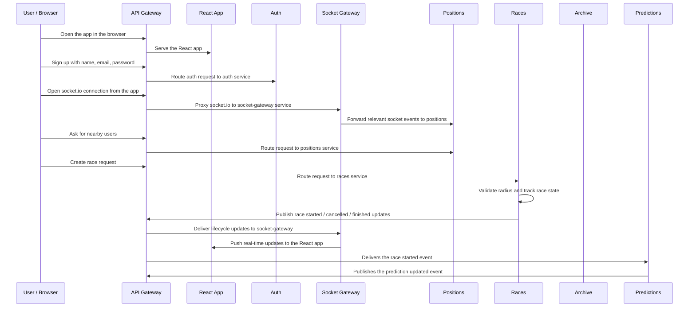
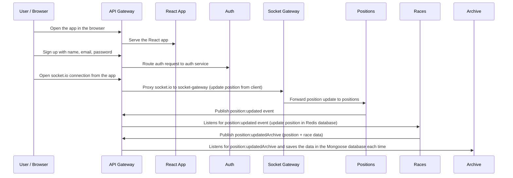
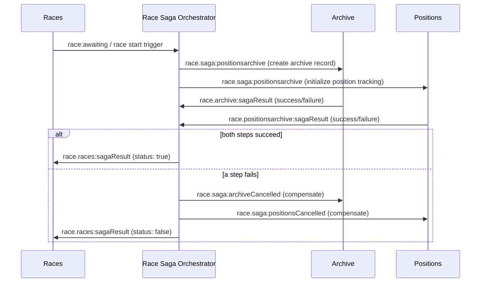

# racer.io

racer.io is a microservices racing app built around an API gateway, live position tracking, and race orchestration. Users reach the gateway first, then the gateway routes them to the React app, the auth service, the positions service, the races service, or the archive service depending on the request. A dedicated socket-gateway service handles the real-time socket.io connection, and a race-saga-orchestrator service keeps the race-start write operations synced across services.

## What You Need

To run the app locally you need:

- Docker
- kubectl
- Skaffold
- a local Kubernetes cluster such as Docker Desktop Kubernetes, minikube, or kind
- a `jwt-secret` Kubernetes secret with both `JWT_KEY` and `ACCESS_JWT_KEY`
- a `ticket-com-tls` TLS secret for the ingress host `ticket.com`

You also need `ticket.com` to resolve to your local ingress IP in your hosts file.

## Run Locally

1. Start your local Kubernetes cluster and make sure `kubectl` is connected to it.
2. Create or confirm the required secrets exist in the cluster.
3. Run `skaffold dev` from the repo root.
4. Add `ticket.com` to your hosts file if it is not already mapped to the ingress controller.
5. Open `https://ticket.com` in your browser.

## API Gateway

The API gateway is the Kubernetes ingress in `infra/k8s/ingress-srv.yaml`. It is the public entry point for the app and the browser connects to it first. It routes traffic to the correct service based on the request path:

- `/api/users` goes to the auth service.
- `/api/positions` goes to the positions service.
- `/socket.io` goes to the socket-gateway service.
- `/api/races` goes to the races service.
- `/api/archive` goes to the archive service.
- everything else goes to the client service.

This keeps the browser talking to one public host while the backend remains split into isolated services. The browser loads the React app through the gateway, and the socket.io connection from the app is proxied through the gateway to the socket-gateway service rather than directly to positions.

Rate limited all the routes using ingress nginx for http requests, and for the socket channel — since it creates a direct TCP connection instead of discrete HTTP requests — the library https://www.npmjs.com/package/rate-limiter-flexible has been used with its own Redis instance inside socket-gateway as the rate-limiting store.

## Core Idea

The app is built around live location tracking and race orchestration. A user signs up through the client, the positions service keeps track of where users are, and the races service decides whether a race can be created, accepted, started, and finished. The socket-gateway service is what actually pushes those state changes to the browser in real time, and the race-saga-orchestrator makes sure that when a race starts, every service's write operation (archive record, positions state) completes consistently or the whole step is rolled back.

## Architecture

- `client`: React front end for signup, login, the dashboard, and race history.
- `auth`: user signup, signin, and current-user endpoints.
- `positions`: receives location updates, finds nearby users, and emits position events.
- `archive`: receives user positions and races, doesn't emit any events currently.
- `races`: creates race records, handles acceptance, tracks active races, and marks them finished.
- `socket-gateway`: owns the client's socket.io connection, applies socket-channel rate limiting via Redis, and routes real-time events between the browser and the backend services (mainly positions).
- `race-saga-orchestrator`: uses the saga orchestration pattern to sync the race-start flow across the archive and positions services, tracking step completion and triggering compensation if a step fails.
- `common`: shared events, middleware, enums, and error helpers: https://www.npmjs.com/package/@racer-io/common
- `predictions`: FastAPI server running a prediction model (multi-layer perceptron) trained on marathon data: https://www.kaggle.com/datasets/aiaiaidavid/the-big-dataset-of-ultra-marathon-running
- `infra`: Kubernetes manifests and ingress configuration for local or cluster deployment.

The services are intentionally split so each one owns its own data and responsibility:

- auth owns user accounts and stores them in its own MongoDB.
- positions owns live location state and stores it in its own Redis instance.
- races owns race records in its own MongoDB and race state in its own Redis instance.
- archive owns archived race/position records in its own MongoDB.
- socket-gateway owns socket-channel rate-limiting state in its own Redis instance; it does not own a MongoDB.
- race-saga-orchestrator owns saga step-tracking state (which services have completed which step) in its own MongoDB; it does not own a Redis instance.
- NATS is the event bus used to move events between services.

## Deployment Layout

The `skaffold.yaml` file builds and syncs the app containers:

- `racer-auth`
- `racer-positions`
- `racer-races`
- `racer-client`
- `racer-archive`
- `racer-socket-gateway`
- `racer-race-saga-orchestrator`

The `infra/k8s` folder wires the runtime pieces together:

- `ingress-srv.yaml` is the API gateway. It exposes the app on `ticket.com` and routes `/api/users`, `/api/positions`, `/api/races`, `/api/archive`, `/api/predictions`, `/socket.io`, and the client root path.
- `auth-depl.yaml` runs the auth service with its own MongoDB and NATS.
- `positions-depl.yaml` runs the positions service with its own Redis and NATS.
- `races-depl.yaml` runs the races service with its own MongoDB, its own Redis, and NATS.
- `archive-depl.yaml` runs the archive service with its own MongoDB and NATS.
- `client-depl.yaml` serves the React app.
- `predictions-depl.yaml` runs the predictions service and serves the prediction model.
- `socket-gateway-depl.yaml` runs the socket-gateway service, its own Redis instance for rate limiting, and routes socket events to the correct backend service.
- `race-saga-orchestrator-depl.yaml` runs the race-saga-orchestrator service and its own MongoDB, and syncs the events launched by the races service, making sure every other service involved in the race-start flow is kept in sync (more details on saga orchestration patterns: https://learn.microsoft.com/en-us/azure/architecture/patterns/saga).
- `nats-depl.yaml` provides the event bus used for inter-service communication.

Each service owns its own storage. The databases and Redis instances are not shared between services. Some services don't have storage of their own kind: socket-gateway doesn't own a MongoDB, and race-saga-orchestrator doesn't own a Redis instance.

## Events

Events are sent through NATS so services can react to state changes without being tightly coupled.

### Shared Subjects

- `user:created`: published by auth after signup, consumed by races to create the local user record.
- `user:updated`: published by auth when a user profile changes, consumed by races to keep the local copy in sync.
- `position:updated`: published by positions when a client sends a new GPS sample, consumed by races to keep live user position state current.
- `position:updatedArchive`: published by races after processing a position update, consumed by archive to persist position/race data.
- `race:awaiting`: published by races after a race is created, consumed by socket-gateway to notify the invited user over socket.io.
- `race:started`: published by races after a race is accepted, consumed by socket-gateway to update socket state and user status, and by predictions to trigger a prediction run.
- `race:cancelled`: published by races when a race is rejected, consumed by socket-gateway to notify the waiting user.
- `race:finished`: published by races when a winner is detected, consumed by socket-gateway to reset users back to idle.
- working on new events for the predictions service

### Saga Subjects (race-start flow)

The race-start flow is coordinated by the race-saga-orchestrator using a dedicated set of subjects, kept separate from the shared subjects above so trigger events and result/ack events never collide on the same channel:

- `race.saga:positionsarchive`: published by the orchestrator to trigger both archive and positions to do their part of the race-start work (create the archive record, initialize position tracking).
- `race.archive:sagaResult`: published by archive back to the orchestrator, reporting success or failure of its step.
- `race.positionsarchive:sagaResult`: published by positions back to the orchestrator, reporting success or failure of its step.
- `race.races:sagaResult`: published by the orchestrator to the races service once all steps have completed, reporting the final saga outcome.
- `race.saga:archiveCancelled` / `race.saga:positionsCancelled`: published by the orchestrator during compensation if one service's step fails after the other has already completed, telling that service to roll back.

### Event Flow

1. The client sends a signup request to the auth service.
2. Auth creates the user and publishes `user:created`.
3. Races stores that user locally so race records can be resolved without calling auth.
4. The client sends live GPS updates through the gateway to positions.
5. Positions updates Redis and publishes `position:updated`.
6. Races consumes the position stream to keep race logic aligned with the latest user locations and publishes a `position:updatedArchive` event for the archive service to persist.
7. When the client creates a race, races publishes `race:awaiting`.
8. The race-saga-orchestrator picks up the race-start step, publishes `race.saga:positionsarchive` to trigger archive and positions, and tracks each service's `sagaResult` response until both steps complete (or compensates if one fails).
9. Once both steps complete, the orchestrator publishes `race.races:sagaResult` to notify races of the final outcome.
10. Socket-gateway receives `race:awaiting` and emits the invitation to the invited user over socket.io.
11. When the race is accepted or rejected, races publishes `race:started` or `race:cancelled`.
12. Socket-gateway receives those lifecycle events and pushes the socket updates to the browser.
13. When a winner is detected, races publishes `race:finished` and socket-gateway resets both users back to idle.

```mermaid
flowchart LR
  Auth[Auth Service]
  Races[Races Service]
  Positions[Positions Service]
  Archive[Archive Service]
  SocketGateway[Socket Gateway]
  Saga[Race Saga Orchestrator]
  NATS[NATS]

  Auth -->|user:created / user:updated| NATS
  Positions -->|position:updated| NATS
  Races -->|race:awaiting / race:started / race:cancelled / race:finished| NATS
  Races -->|position:updatedArchive| NATS
  Saga -->|race.saga:positionsarchive| NATS
  Archive -->|race.archive:sagaResult| NATS
  Positions -->|race.positionsarchive:sagaResult| NATS
  Saga -->|race.races:sagaResult| NATS

  NATS --> Races
  NATS --> Positions
  NATS --> Archive
  NATS --> SocketGateway
  NATS --> Saga
```

## How The Flow Works

1. A user signs up in the client with a name, email, and password.
2. The auth service creates the user account and returns the authenticated session.
3. The client streams GPS updates to the positions service.
4. The positions service keeps track of nearby users and broadcasts position updates to the races service.
5. The client creates a race request when two users are close enough (validation and calculations are done to ensure that the race could be possible).
6. The race-saga-orchestrator coordinates the archive and positions services so the race-start write operations are applied consistently across both databases.
7. The races service stores the race, waits for acceptance, and monitors the race until a winner is found.
8. Socket-gateway keeps the browser in sync in real time throughout, from the initial race invitation to the finish.
9. All of this to ensure a robust race flow with a microservices architecture; more details are in the code.

## Service Diagram

```mermaid
flowchart LR
  Gateway[API Gateway / Ingress]
  Client[Client Service / React App]
  Auth[Auth Service]
  Positions[Positions Service]
  Races[Races Service]
  Archive[Archiving service]
  SocketGateway[Socket Gateway]
  Saga[Race Saga Orchestrator]
  Common[Common Package]
  NATS[NATS Streaming]
  AuthMongo[(Auth MongoDB)]
  PositionsRedis[(Positions Redis)]
  RacesMongo[(Races MongoDB)]
  RacesRedis[(Races Redis)]
  ArchiveMongo[(Archive MongoDB)]
  SocketGatewayRedis[(Socket Gateway Redis)]
  SagaMongo[(Saga Orchestrator MongoDB)]

  User[Browser / User] --> Gateway
  Gateway --> Client
  Gateway --> Auth
  Gateway -->|/socket.io| SocketGateway
  Gateway -->|/api/positions| Positions
  Gateway --> Races
  Gateway --> Archive

  Auth --> AuthMongo
  Auth --> NATS

  Positions --> PositionsRedis
  Positions --> NATS

  Races --> RacesMongo
  Races --> RacesRedis
  Races --> NATS

  Archive --> NATS
  Archive --> ArchiveMongo

  SocketGateway --> SocketGatewayRedis
  SocketGateway --> NATS

  Saga --> SagaMongo
  Saga --> NATS

  Common -.shared contracts.-> Auth
  Common -.shared contracts.-> Positions
  Common -.shared contracts.-> Races
  Common -.shared contracts.-> SocketGateway
  Common -.shared contracts.-> Saga
```

## Request Flow

```mermaid
sequenceDiagram
  participant U as User / Browser
  participant G as API Gateway
  participant C as React App
  participant A as Auth
  participant SG as Socket Gateway
  participant P as Positions
  participant R as Races
  participant H as Archive
  participant W as Predictions

  U->>G: Open the app in the browser
  G->>C: Serve the React app
  U->>G: Sign up with name, email, password
  G->>A: Route auth request to auth service
  U->>G: Open socket.io connection from the app
  G->>SG: Proxy socket.io to socket-gateway service
  SG->>P: Forward relevant socket events to positions
  U->>G: Ask for nearby users
  G->>P: Route request to positions service
  U->>G: Create race request
  G->>R: Route request to races service
  R->>R: Validate radius and track race state
  R->>G: Publish race started / cancelled / finished updates
  G->>SG: Deliver lifecycle updates to socket-gateway
  SG->>C: Push real-time updates to the React app

  G->>W: Delivers the race started event
  W->>G: Publishes the prediction updated event
```

## Position Update Flow

```mermaid
sequenceDiagram
  participant U as User / Browser
  participant G as API Gateway
  participant C as React App
  participant A as Auth
  participant SG as Socket Gateway
  participant P as Positions
  participant R as Races
  participant H as Archive

  U->>G: Open the app in the browser
  G->>C: Serve the React app
  U->>G: Sign up with name, email, password
  G->>A: Route auth request to auth service
  U->>G: Open socket.io connection from the app
  G->>SG: Proxy socket.io to socket-gateway (update position from client)
  SG->>P: Forward position update to positions
  P->>G: Publish position:updated event
  G->>R: Listens for position:updated event (update position in Redis database)
  R->>G: Publish position:updatedArchive (position + race data)
  G->>H: Listens for position:updatedArchive and saves the data in the Mongoose database each time
```

## Race Start Saga Flow

```mermaid
sequenceDiagram
  participant R as Races
  participant Saga as Race Saga Orchestrator
  participant H as Archive
  participant P as Positions

  R->>Saga: race:awaiting / race start trigger
  Saga->>H: race.saga:positionsarchive (create archive record)
  Saga->>P: race.saga:positionsarchive (initialize position tracking)
  H->>Saga: race.archive:sagaResult (success/failure)
  P->>Saga: race.positionsarchive:sagaResult (success/failure)
  alt both steps succeed
    Saga->>R: race.races:sagaResult (status: true)
  else a step fails
    Saga->>H: race.saga:archiveCancelled (compensate)
    Saga->>P: race.saga:positionsCancelled (compensate)
    Saga->>R: race.races:sagaResult (status: false)
  end
```